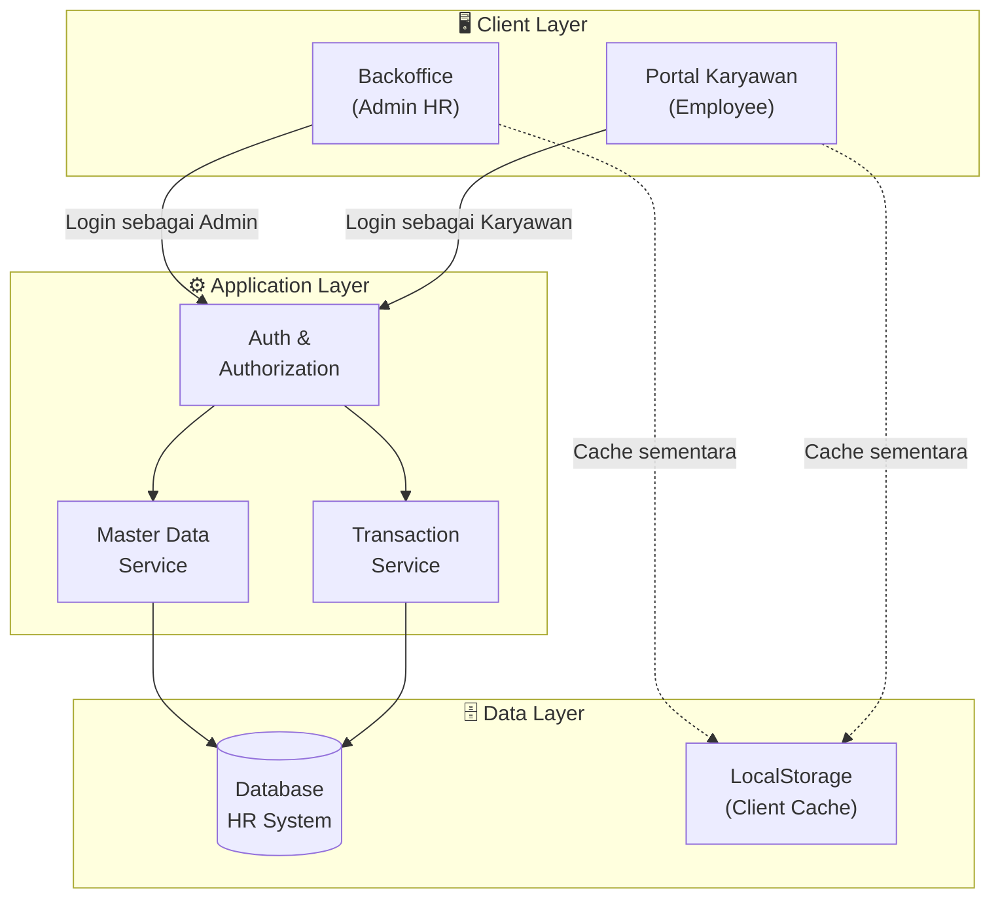
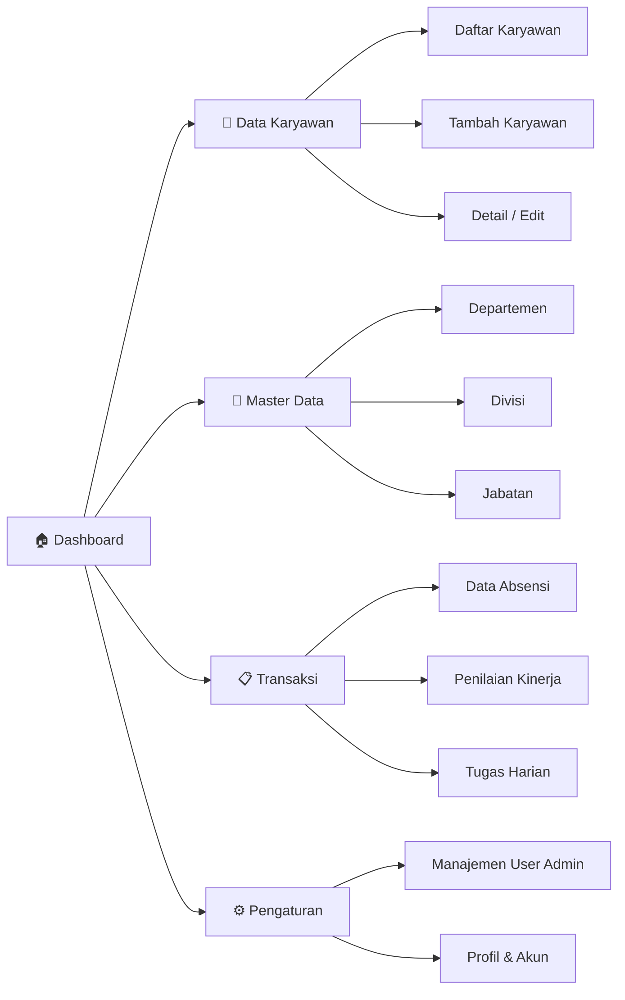
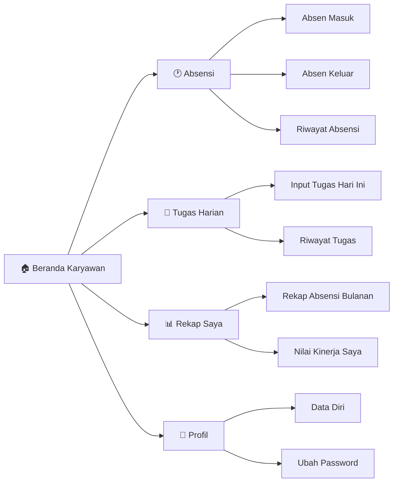
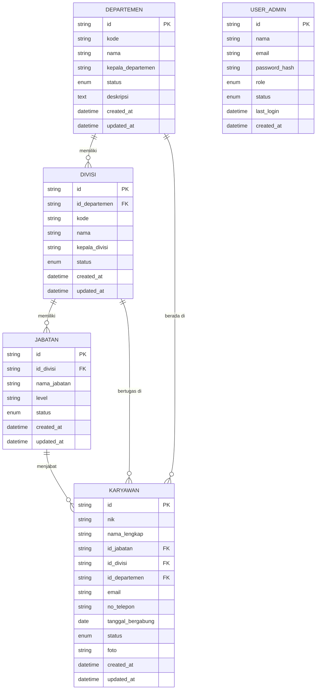
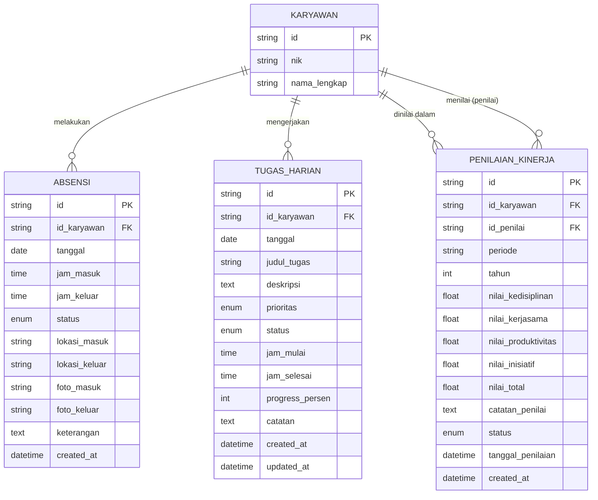
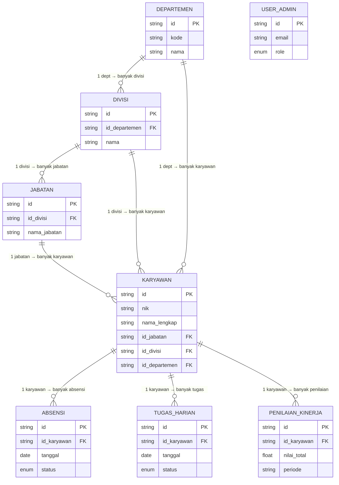
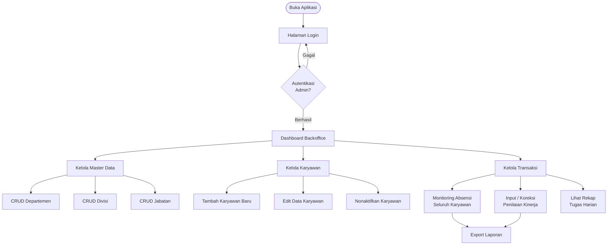
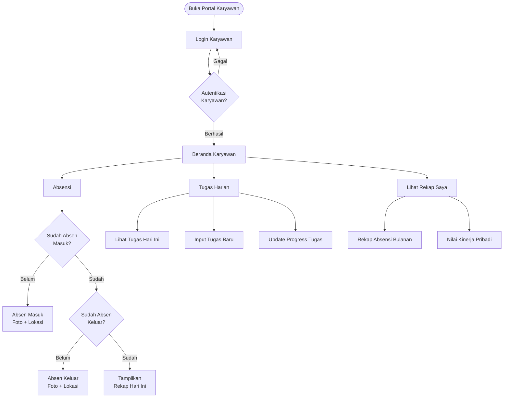

# Perancangan Sistem HR Management

> Dokumen ini berisi perancangan teknis aplikasi HR Management System, mencakup arsitektur aplikasi, hierarki menu, Entity Relationship Diagram (ERD), dan struktur file proyek.

---

## Daftar Isi

1. [Gambaran Umum Sistem](#1-gambaran-umum-sistem)
2. [Arsitektur Aplikasi](#2-arsitektur-aplikasi)
3. [Hierarki Menu](#3-hierarki-menu)
   - [3.1 Backoffice (Admin)](#31-backoffice-admin)
   - [3.2 Portal Karyawan](#32-portal-karyawan)
4. [Entity Relationship Diagram (ERD)](#4-entity-relationship-diagram-erd)
   - [4.1 Tabel Master](#41-tabel-master)
   - [4.2 Tabel Transaksi](#42-tabel-transaksi)
   - [4.3 Relasi Antar Tabel](#43-relasi-antar-tabel)
5. [User Flow](#5-user-flow)
   - [5.1 Alur Admin Backoffice](#51-alur-admin-backoffice)
   - [5.2 Alur Karyawan](#52-alur-karyawan)
6. [Struktur File Proyek](#6-struktur-file-proyek)

---

## 1. Gambaran Umum Sistem

HR Management System adalah aplikasi web yang terdiri dari **dua antarmuka utama**:

| Aplikasi            | Pengguna | Fungsi Utama                                              |
| ------------------- | -------- | --------------------------------------------------------- |
| **Backoffice**      | Admin HR | Kelola data master, monitoring absensi, penilaian kinerja |
| **Portal Karyawan** | Karyawan | Absensi mandiri, input tugas harian, lihat rekap pribadi  |

Kedua aplikasi berbagi satu basis data yang sama dengan kontrol akses berbeda.

---

## 2. Arsitektur Aplikasi



---

## 3. Hierarki Menu

### 3.1 Backoffice (Admin)



### 3.2 Portal Karyawan



---

## 4. Entity Relationship Diagram (ERD)

### 4.1 Tabel Master



### 4.2 Tabel Transaksi



### 4.3 Relasi Antar Tabel



---

## 5. User Flow

### 5.1 Alur Admin Backoffice



### 5.2 Alur Karyawan



---

## 6. Struktur File Proyek

```
hr-management/
|
├── docs/
│   └── PERANCANGAN.md          ← Dokumen perancangan ini
|
├── assets/
│   ├── css/
│   │   ├── main.css            ← Style global
│   │   ├── sidebar.css         ← Komponen sidebar
│   │   └── components.css      ← Komponen reusable (card, badge, dll)
│   │
│   ├── js/
│   │   ├── app.js              ← Entry point & inisialisasi global
│   │   ├── storage.js          ← Helper localStorage (CRUD generic)
│   │   ├── auth.js             ← Logika autentikasi global
│   │   ├── components-loader.js← Loader partial HTML dari folder components/
│   │   ├── validation.js       ← Helper validasi form
│   │   └── utils.js            ← Fungsi utilitas umum
│   │
│   └── img/
│       ├── logo.png
│       └── default-avatar.png
|
├── components/                 ← Partial HTML reusable agar header/navbar/footer tidak di-copy di setiap halaman
│   ├── header.html             ← Header/topbar reusable untuk Admin dan Portal Karyawan
│   ├── navbar.html             ← Sidebar Admin dan navbar Portal Karyawan
│   └── footer.html             ← Footer reusable
├── pages/
│   │
│   ├── data-departemen/
│   │   ├── index.html          ← Daftar departemen
│   │   ├── form.html           ← Tambah / Edit departemen
│   │   └── script.js           ← Logic CRUD departemen
│   │
│   ├── data-divisi/
│   │   ├── index.html          ← Daftar divisi
│   │   ├── form.html           ← Tambah / Edit divisi
│   │   └── script.js           ← Logic CRUD divisi
│   │
│   ├── data-jabatan/
│   │   ├── index.html          ← Daftar jabatan
│   │   ├── form.html           ← Tambah / Edit jabatan
│   │   └── script.js           ← Logic CRUD jabatan
│   │
│   ├── data-karyawan/
│   │   ├── index.html          ← Daftar karyawan
│   │   ├── form.html           ← Tambah / Edit karyawan
│   │   ├── detail.html         ← Detail profil karyawan
│   │   └── script.js           ← Logic CRUD & detail karyawan
│   │
│   ├── data-absensi/
│   │   ├── index.html          ← Rekap absensi (Admin view)
│   │   ├── detail.html         ← Detail absensi per karyawan
│   │   └── script.js           ← Logic rekap & detail absensi admin
│   │
│   ├── data-penilaian/
│   │   ├── index.html          ← Daftar penilaian kinerja
│   │   ├── form.html           ← Form penilaian
│   │   └── script.js           ← Logic CRUD penilaian kinerja
│   │
│   ├── data-tugas/
│   │   ├── index.html          ← Rekap tugas harian (Admin view)
│   │   ├── detail.html         ← Detail tugas per karyawan
│   │   └── script.js           ← Logic rekap & detail tugas admin
│   │
│   └── user-admin/
│       ├── index.html          ← Daftar user admin
│       ├── form.html           ← Tambah / Edit user admin
│       └── script.js           ← Logic CRUD user admin
|
├── employee/                   ← Portal Karyawan (aplikasi terpisah)
│   ├── index.html              ← Beranda karyawan (setelah login)
│   ├── login.html              ← Login karyawan
│   ├── script.js               ← Logic dashboard & login karyawan
│   │
│   ├── absensi/
│   │   ├── index.html          ← Form absen masuk/keluar
│   │   ├── riwayat.html        ← Riwayat absensi pribadi
│   │   └── script.js           ← Logic absensi karyawan
│   │
│   ├── tugas/
│   │   ├── index.html          ← Daftar tugas hari ini
│   │   ├── form.html           ← Input tugas baru / update progress
│   │   └── script.js           ← Logic tugas karyawan
│   │
│   └── profil/
│       ├── index.html          ← Profil & ubah password
│       └── script.js           ← Logic profil & ubah password
|
├── index.html                  ← Landing / redirect ke login admin
└── script.js                   ← Logic landing / redirect global awal
```

---

## Catatan Teknis

| Aspek                | Keterangan                                                                      |
| -------------------- | ------------------------------------------------------------------------------- |
| **Penyimpanan data** | `localStorage` untuk prototyping; migrasi ke REST API / backend saat production |
| **Storage key**      | Prefix `hr_` untuk semua key (contoh: `hr_departemen`, `hr_karyawan`)           |
| **ID record**        | Format `{entitas}-{timestamp}` (contoh: `dep-1718000000000`)                    |
| **Autentikasi**      | `sessionStorage` untuk sesi login aktif; timeout otomatis setelah idle          |
| **Validasi**         | Semua form menggunakan validasi client-side sebelum simpan ke storage           |
| **Notifikasi**       | Toast notification via Bootstrap untuk feedback aksi CRUD                       |
| **Foto absensi**     | Capture via `getUserMedia()` API (kamera perangkat)                             |
| **Lokasi absensi**   | `navigator.geolocation` API untuk koordinat GPS                                 |

---
